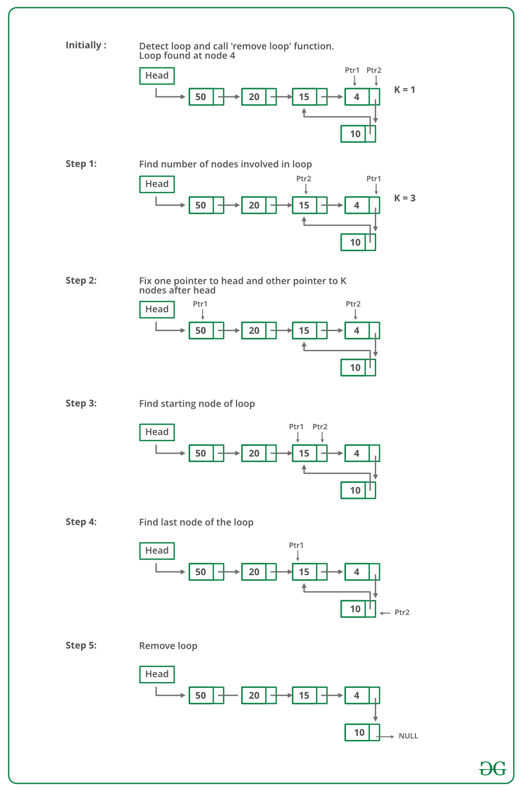

# Detect and Remove Loop in a Linked List

Write a function *detectAndRemoveLoop()* that checks whether a given Linked List contains loop and if loop is present then removes the loop and returns true. If the list doesn’t contain loop then it returns false. Below diagram shows a linked list with a loop. *detectAndRemoveLoop()* must change the below list to 1->2->3->4->5->NULL.

**Solution** 

1. This method is also dependent on Floyd’s Cycle detection algorithm.
2. Detect Loop using Floyd’s Cycle detection algorithm and get the pointer to a loop node.
3. Count the number of nodes in loop. Let the count be k.
4. Fix one pointer to the head and another to a kth node from the head.
5. Move both pointers at the same pace, they will meet at loop starting node.
6. Get a pointer to the last node of the loop and make next of it as NULL.

## Reference:

https://www.geeksforgeeks.org/detect-and-remove-loop-in-a-linked-list/